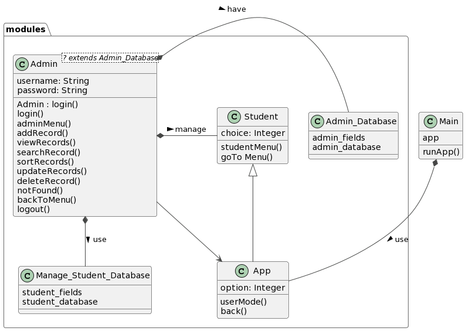
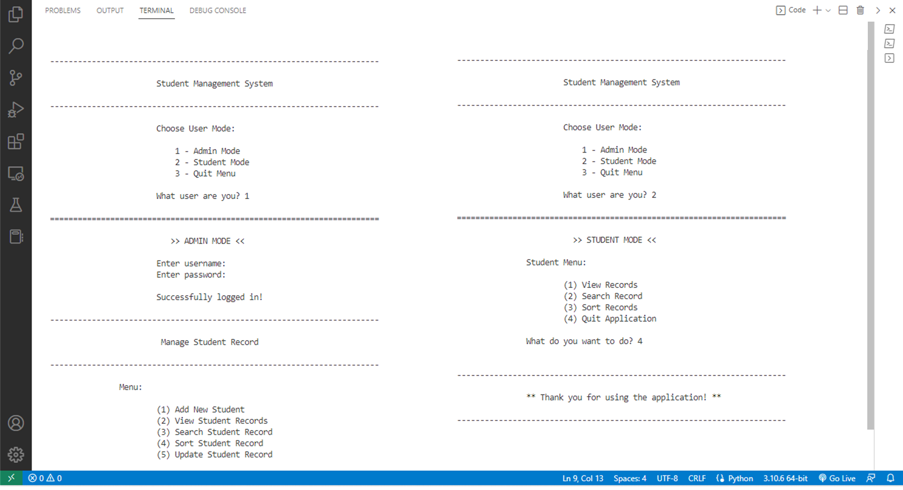

Student Management System
=========================
A console application coded in Python programming language that used ```csv``` as database for storing records. The main focus of this console app is to allow the users to manipulate student information stored in the database.  This project is a user-friendly application created to store and monitor student records conveniently. 

🤔 Overview
-------------
Our system handles records with the aid of the following sources:
1. This project uses ```csv``` as database. The imported database writes data in the format preferred by ```Excel```.
2. ```operator``` module: Used to sort all student records stored in our database.

> The csv database is obtained from importing the csv module by ```import csv``` to create the databases that we use: ```students.csv``` and ```admin.csv```. It contains the student records managed by the Admin user and the login information of the admin. We used csv module’s ```reader``` and ```writer``` objects to read and write data from user and store it. Apart from this source that describe the SMS data, we also used the ```operator``` module, which is mainly used for sorting the records for easy viewing. It provides the method ```operator.itemgetter()``` to retrieve values on a specific field. In the program it is used as ```data = sorted(data, key=operator.itemgetter(1))``` to ```sort``` the stored data in our csv database.

📌 Features
-------------
Student Management System provides the following features:
##### 1. Main App Menu UI
##### 2. Admin Mode                                                           
+ Admin Login                                                              
+ Admin Menu                                                                 
  * Add student records that will be stored in database                      
  * View the stored student records
  * Search student records 
  * Sort student records in the database
  * Update the stored records
  * Delete specific student record
##### 3. Student Mode
+ Student Menu
  * View and retrieve records from database
  * Sort records for easy viewing
  * Search certain student record

🧐 Diagram
------------------
<p align="center">
    
</p>

💡 Dependencies
----------------
+ All codes are written in ```Python 3```.
+ Some codes depends on the ```csv``` module.
  * ```Admin.py```
  * ```Student.py```
+ Some codes depends on the ```operator``` module.
  * ```Admin.py```
+ Some codes depends on the ```sys``` module.

✍️ Description of Files
------------------------
Non-Python files:

filename                |  description
------------------------|------------------------------------------------------------------------------------
README.md               |  Text file (markdown format) description of the project.
students.csv            |  CSV file, used as database for student records.
admin.csv               |  CSV file, used as database for admin login information.

Modules:

filename                |  description
------------------------|------------------------------------------------------------------------------------
App.py                  |  Contains the main app menu functions
Admin.py                |  Contains the functions that only the Admin user can perform
Student.py              |  Contains the functions that the Student can only perform to use the program

Python files:

filename                |  description
------------------------|------------------------------------------------------------------------------------
Main.py                 |  Python file that contains the driver code 

🧑‍💻 Project Demo
-----------------
For our project demo, click [Student Management System Demo](https://www.youtube.com/watch?v=OEotgZwW5k4) to see the presentation of the codes and live simulation of the program.

<p align="center">
    
</p>
 
💻 Installation
----------------
1. Click [Student Management System](https://github.com/elaijavelasco/CS121-student-management-system.git) to be directed to the project's repository.
2. Click on the Code button, then download the repository as ZIP file.
3. Locate the downloaded ZIP file, likely in your Downloads folder, and unzip it.
4. Open the unzipped or the extracted folder and find ```Main.py``` file.
5. Open the file via any IDE that supports Python programming language.
6. Then, run the file to launch the application.

🤝 Acknowledgements
--------------------
+ [GeeksForGeeks](https://www.geeksforgeeks.org/) were incredibly helpful while I was building the program
+ [Markdown Cheatsheet](https://github.com/adam-p/markdown-here/wiki/Markdown-Cheatsheet?fbclid=IwAR2wjT8IG-2nDMH-PZWVG3MtUFPcu9asQ-bJfOUmn3T2H8QrLRYxVSDuqZ8) for quick reference 
+ [Python](https://www.python.org/) for reference in using [csv](https://docs.python.org/3/library/csv.html) module and [operator](https://docs.python.org/3/library/operator.html) module
+ [PlantUML](https://plantuml.com/) for reference in creating class diagram

👩‍💻Contributors
----------------
+ [Elaija Heart Velasco](https://github.com/elaijavelasco)
+ [Erick Vonn David Balintataw](https://github.com/ErickVonnDavidBalintataw)
+ [Ma Pia Paula Celemin](https://github.com/MaPiaPaulaC)

⚠️ License
------------
[MIT License](LICENSE)
